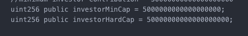
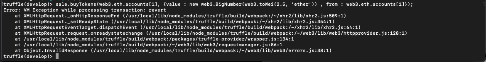
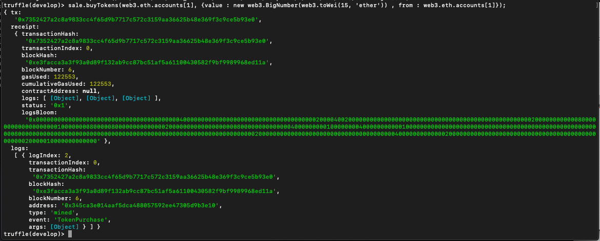
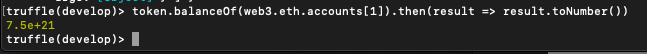

<h1>cappedCrowdTokenSale</h1>
<h2>Task: Code a Solidity contract for a simple capped crowd sale token.</h2>

<h2>Process:</h2>
<ol>
  <li>
    <h3>Readings to follow: </h3>
    <ul><li>There are two readings that you can follow to understand the creation of a smart contract: <a href="https://medium.com/crowdbotics/how-to-build-a-simple-capped-crowdsale-token-using-openzeppelin-library-part-1-2789ec642308">Article One</a>, <a href="https://medium.com/crowdbotics/how-to-build-a-simple-capped-crowdsale-token-using-openzeppelin-library-part-2-cf96cb66c3d0">Article two</a>.</li></ul>
  </li>
  <li>
    <h3>Downloads required:</h3>
    <ul>
      <li>Install <strong>Node.js</strong> <em>version: 10.15.3</em>.  Installing Node.js will automatically install <strong>NPM</strong>. Need Help installing click <a href="https://www.npmjs.com/get-npm">here</a>.</li>
      <li>Install <strong>openZeppelin library</strong> <em>version: 1.10.0</em> using <strong>NPM</strong>.  OpenZeppelin is a library for secure smart contract development. Need Help installing click <a href="https://www.npmjs.com/package/openzeppelin-solidity">here</a>.</li>
      <li>Install <strong>Truffle</strong> <em>version: 4.1.15</em> using <strong>NPM</strong>. Truffle is a development environment used for testing framework and asset pipeline for blockchains using the Ethereum Virtual Machine. Need Help installing click <a href="https://truffleframework.com/truffle">here</a>.</li>
    </ul>
  </li>
  <li><h3>Creating contracts:</h3>
    <ul>
      <li>Create a file name <strong>ExampleToken.sol</strong>. Save it under the <em>contracts</em> folder that was created when installing openZeppelin. Within the file <strong>ExampleToken.sol</strong> enter the information from the same name contract posted in <a href="https://medium.com/crowdbotics/how-to-build-a-simple-capped-crowdsale-token-using-openzeppelin-library-part-1-2789ec642308">part 1</a>.</li>
      <li>Secondly, Create a file name <strong>ExampleTokenCrowdsale.sol</strong>. Save it under the <em>contracts</em> folder that was created when installing openZeppelin. Within the file <strong>ExampleTokenCrowdsale.sol</strong> enter the information from the same named contract posted in <a href="https://medium.com/crowdbotics/how-to-build-a-simple-capped-crowdsale-token-using-openzeppelin-library-part-1-2789ec642308">part 1</a>.</li>
    </ul>
  </li>
  <li>
    <h3>Required Changes: </h3>
    <ul><li>Part One:</li>
    <ol>
      <li>Change the minimum contribution to 5 Ether.</li>
      <li>Add method, getTokensLeft, to report how many tokens are left.</li>
      <li>Once you've successfully implemented, deployed, and tested the contracts move on to part two of required changes.</li>
    </ol>
      <li>Part Two:</li>
      <ol>
        <li> Change following parameters of the contract: <strong>Token name: "CSC4980 Token", Token symbol: "GSU", Token decimals: 18, rate: 450 tokens x Ether, Cap: 150 Ether</strong>.</li>
        <li>Try to buy tokens with 2.5 ether.</li>
        <li>Buy tokens with 15 ether.</li>
        <li>Return how many tokens are left.</li>
      </ol>
    </ul>
  </li>
 </ol>
 

 <H2>Useful commands used: </h2>
 <ul>
  <li>Compiling with truffle: 
    <ol>
      <li><strong>truffle compile</strong></li>
      <li><strong>truffle develop</strong></li>
      <li><strong>migrate --reset</strong></li>
    </ol>
  </li>
  <li>Deploying ExampleToken contract with it's parameters <em>token name</em>, <em>symbol</em>, <em>decimal point</em>: 
  <ol>
    <li><strong>ExampleToken.deployed("CSC 4980", "GSU", 18).then((t) => {token = t;})</strong></li>
    </ol>
  </li>
  <li>Deploying ExampleTokenCrowdsale contract with its parameters <em>rate (450 token/ether)</em>, <em>wallet (web3.eth.accounts[0])</em>, <em> ERC20 token (Example Token address)</em>, and <em>cap (150 ether)</em>:
  <ol>
    <li><strong>ExampleTokenCrowdsale.deployed(450, web3.eth.accounts[0], token.address , new web3.BigNumber(web3.toWei(150, 'ether'))).then((t) => {sale = t;})</strong></li>
    </ol>
  </li>
  <li>Performing transactions:
  <ol>
    <li><strong>sale.buyTokens(web3.eth.accounts[1], {value : new web3.BigNumber(web3.toWei(1, 'ether')) , from : web3.eth.accounts[1]});</strong></li>
    </ol>
  </li>
 </ul>
 

 <h2>Solutions to required changes:</h2>
 <ul>
  <li>Part One Answer(s):
    <ul><li>A:  </li></ul>
  </li>
  <li>Part Two Answer(s): 
  <ul><li>A:  </li>
    <li>B:  </li>
    <li>C:  </li></ul>
  </li>
 </ul>
 

 <h6>By: Anthony Davis</h6>
